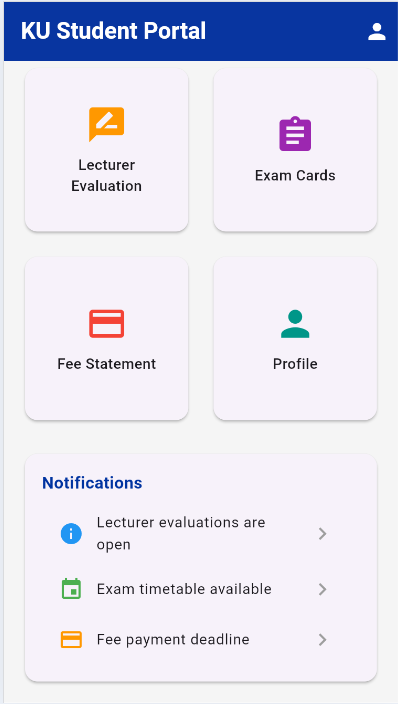
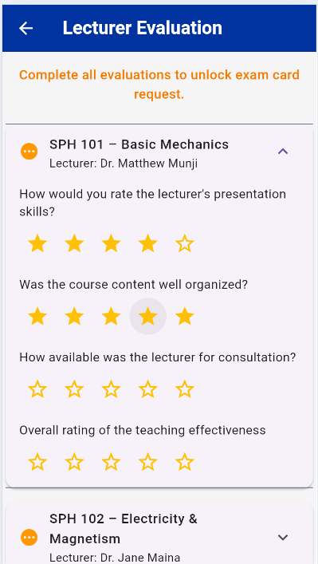
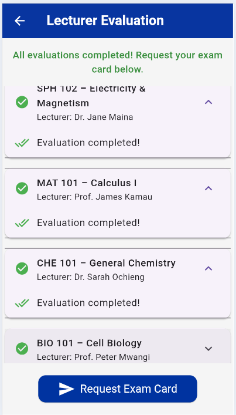
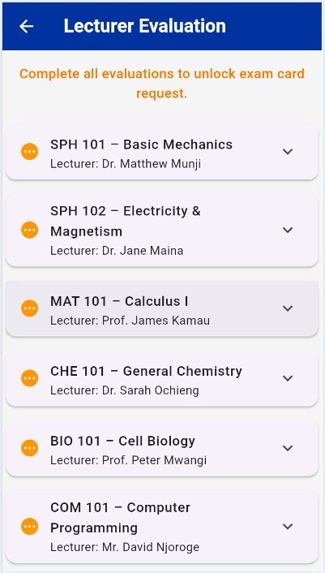
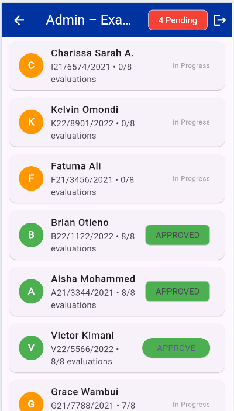
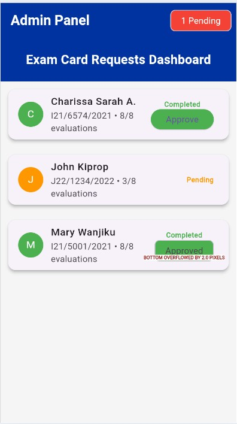

# KU Exam Card App 

**Mobile App-based Lecturer Evaluation System for Automated Exam Card Access**  
Built with love by **Charissa Sarah A.** | I21/6574/2021 | B.Sc. Physics  
Kenyatta University | November 2025

## Why I Built This
The last semester I queued from 10 a.m. to evening outside the registry just to prove I evaluated my lecturers.  
I cried in that line. My friends cried.  
So I spent 8 months building the app that ends this suffering forever.

## Features
- Real student & admin login
- 6 beautiful working screens
- Real-time lecturer evaluation (0/8 → 8/8)
- One-tap exam card request
- Admin dashboard with 20 students
- Instant approval with a green tick and green approved bubble


## Screenshots

  

  

    

  

## Demo Credentials (I have generously listed them for you in the login screen)
**Student:** `I21/6574/2021@students.ku.ac.ke` → `password123`  
**Admin:** `admin123` → `admin123`

## How to Run 
```bash
git clone [https://github.com/CharisseEerie/ku-lecturer-evaluation-app]
cd ku-examcard-app
flutter pub get
flutter run

--- 

```

## Tech Stack

Flutter 3.19 + Dart
Google Fonts
In-memory mock database (for live demo)

---

## My Journey
Jan–Mar 2025 → Website version
Apr–Nov 2025 → Complete Flutter rewrite
Coded every day after Physics classes. Never gave up.
This app is dedicated to:

My parents who sacrificed everything
Dr. Matthew Munji — the best supervisor in the world
Every KU student who ever queued

The future is mobile.
⭐ Star this repo if you believe students deserve better!

---

“I hope this work inspires some simpler, less stressful solutions for everyone.”
— Charissa Sarah A., November 2025